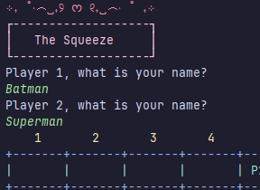
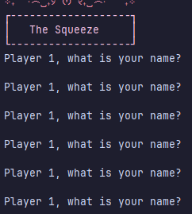
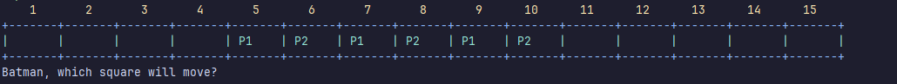
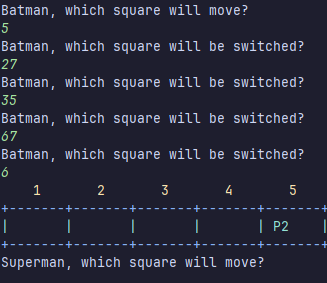
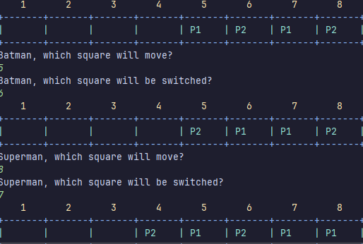
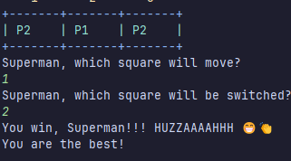
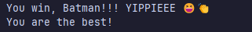

# Results of Testing

The test results show the actual outcome of the testing, following the [Test Plan](test-plan.md)

---

## Player names - valid

I will test that the players name will be accepted when a valid name. 
### Test Data Used

I will enter a valid name that isn't null: **Batman**, **Superman**

### Test Result

the test passed - the valid names were accepted. 

---

## Player names - invalid

I will test that the invalid (null or blank) names won't be accepted

### Test Data Used

I will press space and enter for the player name

### Test Result

the test passed - blank names weren't accepted and the game repeated the question until the name was valid

---

## board setup - gameplay

I will test that the board loads properly

### Test Data Used

I will enter player names and then see the board

### Test Result

the test passed - the game board set up correctly with the players in the correct places. 

---
## Player moves - invalid

I will test that the invalid move won't be accepted

### Test Data Used

I will enter board numbers that don't exist

### Test Result

the test passed - the game continued to ask for a board number until they player entered an existing board number

---
## Player moves - valid

I will test that the valid move will be accepted

### Test Data Used

I will enter board numbers that do exist

### Test Result

the test passed - the game continued as normal

---
## Is there a winner? - valid

I will test that the game can find a winner

### Test Data Used

I will play the game until there is one square left

### Test Result

Or

the test passed - the game got who was the last player on the final square, and give the correct message

---
